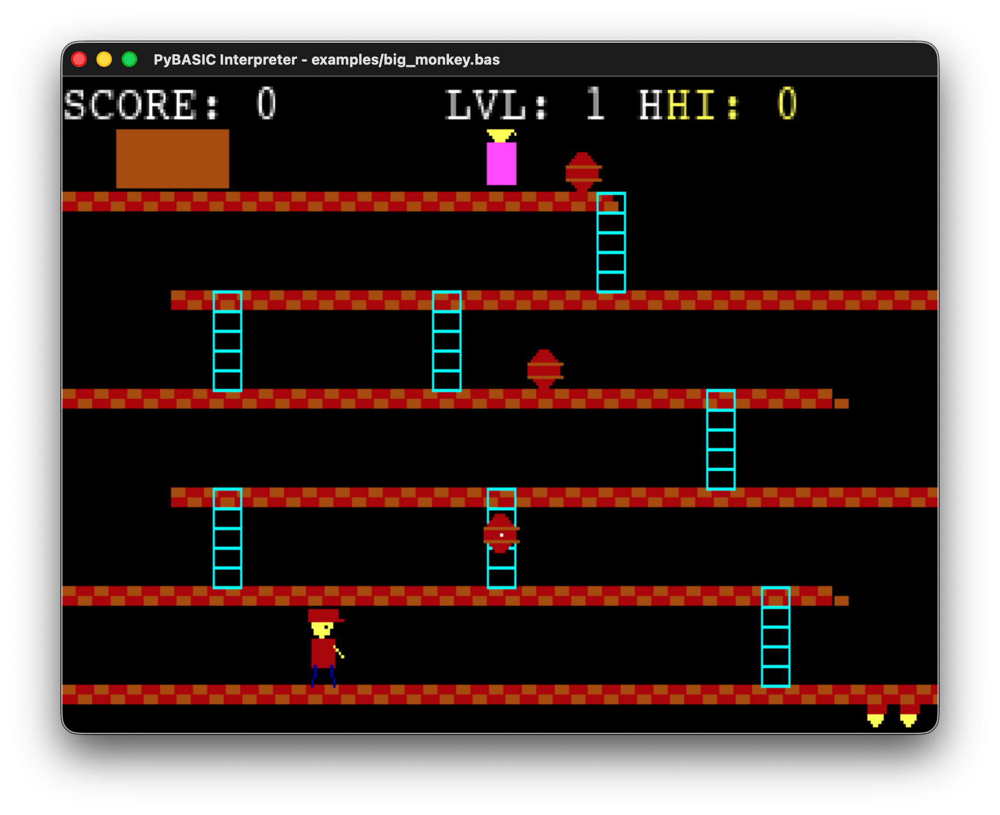
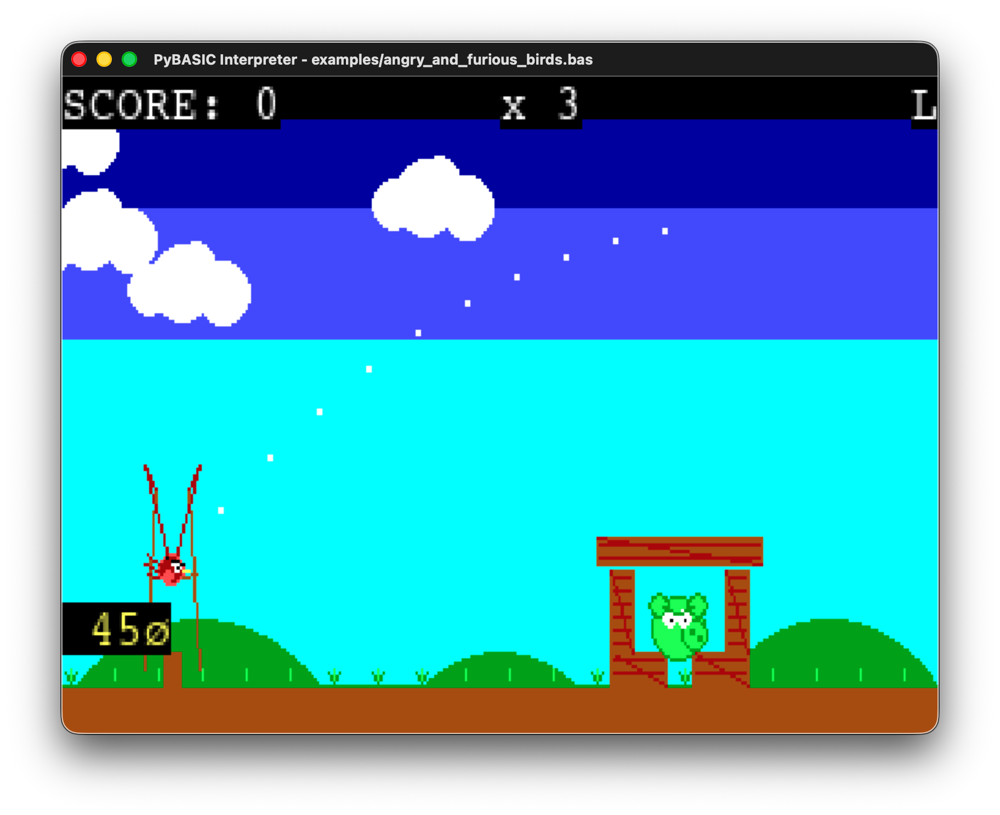

# PanicBasic (pasic)

PanicBasic is an experimental, retro-style BASIC environment combining a code editor, interpreter, and console — all in one application. Written in Python using [pygame](https://www.pygame.org/), it brings back the nostalgia of classic BASIC programming.

## Features

- **Integrated Editor**: Custom text editor with line numbering, undo/redo, cut/copy/paste, and a drawing layer
- **BASIC Interpreter**: Supports classic commands like `SCREEN`, `CLS`, `PRINT`, `LINE`, `CIRCLE`, `PAINT`, loops, conditionals, and more
- **Built-in Console**: Shell-like console for running system commands
- **Retro Graphics**: 320x200 software surface emulating classic BASIC graphics modes
- **Example Games**: Includes Pong, Catch the Star, and other retro-style games

## Installation

### Prerequisites

- Python 3.8 or higher
- pip (Python package manager)

### Step 1: Clone the Repository

```bash
git clone https://github.com/zerojnt/pasic.git
cd pasic
```

### Step 2: Create a Virtual Environment (Recommended)

```bash
# Create virtual environment
python3 -m venv env

# Activate it
# On macOS/Linux:
source env/bin/activate

# On Windows:
env\Scripts\activate
```

### Step 3: Install Dependencies

```bash
pip install -r requirements.txt
```

Or install manually:

```bash
pip install pygame pyperclip
```

## Usage

### Using the Integrated Environment (main.py)

The main entry point provides both editor and interpreter functionality.

**Launch the editor:**
```bash
python main.py
```

**Load a specific file in the editor:**
```bash
python main.py examples/pong.bas
```

**Run a BASIC file directly (interpreter only):**
```bash
python main.py --run examples/pong.bas
```

### Using the Editor Directly (editor.py)

You can also run the editor module directly:

```bash
python editor.py                    # Open with default Pong game
python editor.py myprogram.bas      # Open a specific file
```

### Using the Interpreter Directly (interpreter.py)

Run BASIC programs directly without the editor interface:

```bash
python interpreter.py examples/star.bas
```

## Editor Controls

| Action | Shortcut |
|--------|----------|
| Undo | `Ctrl+Z` |
| Redo | `Ctrl+Shift+Z` |
| Cut | `Ctrl+X` |
| Copy | `Ctrl+C` |
| Paste | `Ctrl+V` |
| Save | `Ctrl+S` |
| Navigate | Arrow keys |
| Jump to position (macOS) | `Option+Click` |
| Drawing | Left-click and drag |
| Erasing | Right-click and drag |

## Modes

Switch between modes using the footer buttons:

- **Text**: Edit your BASIC code
- **Run**: Execute the current program (320x200 scaled to window)
- **Console**: Run shell commands

## Supported BASIC Commands

### Graphics
- `SCREEN 13` - Set 320x200 resolution
- `CLS` - Clear screen
- `LINE (x1, y1)-(x2, y2), color [, B|BF]` - Draw lines/boxes
- `CIRCLE (x, y), radius, color` - Draw circles
- `PAINT (x, y), color` - Flood fill
- `PSET (x, y), color` - Set pixel
- `LOCATE row, col` - Position cursor

### Flow Control
- `IF ... THEN ... ELSE ... END IF`
- `FOR ... TO ... STEP ... NEXT`
- `DO ... LOOP [WHILE|UNTIL]`
- `WHILE ... WEND`
- `SELECT CASE ... END SELECT`
- `GOSUB` / `RETURN`
- `SUB ... END SUB`

### Variables & Data
- `DIM array(size)` - Declare arrays
- `CONST name = value` - Define constants
- `LET var = value` - Assign variables

### Input/Output
- `PRINT` - Output text
- `INPUT` - Get user input
- `INKEY$` - Get key press

### Timing
- `_DELAY seconds` - Non-blocking delay
- `SLEEP seconds` - Blocking delay

## Example Games

The `examples/` folder contains complete games you can play and learn from!

### Big Monkey (Featured)



A **Donkey Kong tribute** featuring classic arcade platforming:
- Climb ladders and platforms to rescue the Princess
- Dodge rolling barrels thrown by Big Monkey
- Jump over barrels for bonus points (+100)
- 5 levels with increasing difficulty
- Animated title screen with menu system
- Sound effects and music (toggle with M key)
- High score tracking

```bash
python main.py --run examples/big_monkey.bas
```

### Angry and Furious Birds (Featured)



A full **Angry Birds clone** with:
- Physics-based bird launching with trajectory preview
- 5 progressive levels with wood and stone structures
- Animated title screen with menu system
- Sound effects and music
- High score tracking

```bash
python main.py --run examples/angry_and_furious_birds.bas
```

### Iron Slug (Featured)


A **Metal Slug tribute** run-and-gun action game:
- Horizontal scrolling shooter with multi-directional aiming
- Multiple enemy types: soldiers, tanks, helicopters, turrets, jetpack troops
- Platform jumping and vertical gameplay
- Rescue POWs for bonus points and power-ups
- Multiple weapons: Pistol, Heavy MG, Rocket Launcher
- Boss battles at the end of each zone
- 5 zones with increasing difficulty
- Sound effects and music (toggle with M key)

```bash
python main.py --run examples/iron_slug.bas
```

### Other Examples

| Game | Description | Command |
|------|-------------|---------|
| **Pong** | Classic two-player paddle game | `python main.py --run examples/pong.bas` |
| **Catch the Star** | Move your basket to catch falling stars | `python main.py --run examples/star.bas` |
| **Pinball** | Pinball with flippers, bumpers, and physics | `python main.py --run examples/pinball.bas` |
| **Car Racing** | Dodge obstacles on an endless road | `python main.py --run examples/car.bas` |
| **Runner** | Endless runner - jump to survive! | `python main.py --run examples/runner.bas` |

## Project Structure

```
pasic/
├── main.py           # Main entry point
├── editor.py         # Text editor with drawing layer
├── interpreter.py    # BASIC interpreter engine
├── requirements.txt  # Python dependencies
├── LICENSE           # MIT License
├── README.md         # This file
├── docs/             # GitHub Pages website
│   ├── index.html
│   └── images/
│       ├── angry_and_furious_birds.png
│       ├── big_monkey.png
│       └── iron_slug.png
└── examples/         # Sample BASIC programs
    ├── big_monkey.bas
    ├── angry_and_furious_birds.bas
    ├── iron_slug.bas
    ├── pong.bas
    ├── star.bas
    ├── car.bas
    ├── pinball.bas
    └── runner.bas
```

## Dependencies

| Package | Version | License |
|---------|---------|---------|
| pygame | 2.5.2+ | LGPL v2.1 |
| pyperclip | 1.8.2+ | BSD 3-Clause |

All dependencies are compatible with the MIT license.

## Contributing

Contributions are welcome! Feel free to:

- Report bugs or request features via [Issues](https://github.com/zerojnt/pasic/issues)
- Submit pull requests
- Share your BASIC programs

## License

This project is licensed under the MIT License. See [LICENSE](LICENSE) for details.

## Author

**Jonathan da Silva Santos**
Email: silva.santos.jonathan@gmail.com

## Acknowledgments

This project was built with extensive assistance from AI tools:
- [Claude Code](https://claude.ai) by Anthropic
- [Gemini](https://gemini.google.com) by Google

---

Enjoy exploring retro BASIC programming in Python!
